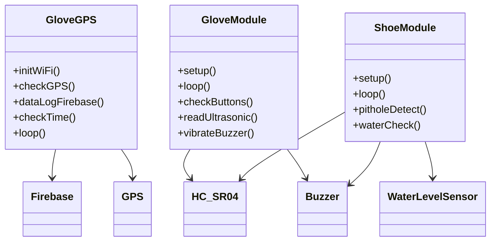
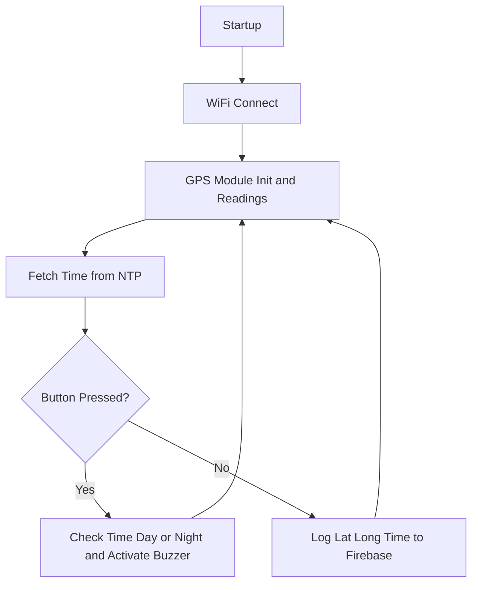
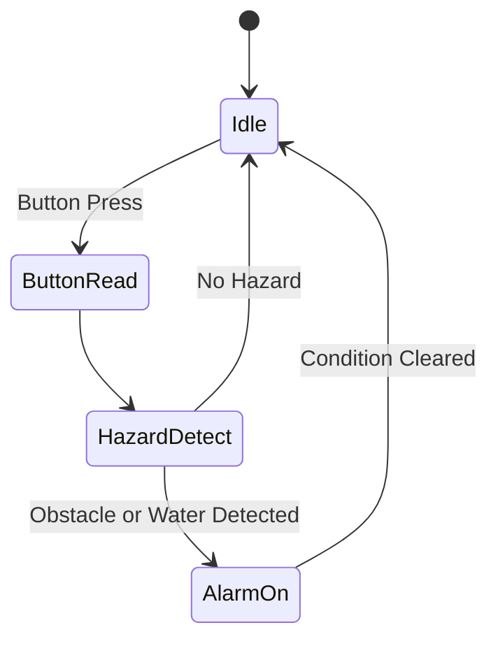

# Wearable Assistive Navigation System: Smart Glove, GPS Logger & Shoe Module

## Abstract

This combined project WANS (Wearable Assistive Navigation System) enables smart assistive features for mobility and safety via wearable devices. The glove GPS logs and transmits location, time, and events to Firebase using ESP8266, GPS module, WiFi, buzzer, and push button. The glove and shoe modules further integrate ultrasonic, water level, and IR sensors to detect pitholes, water obstacles, and proximity, alerting the wearer through vibration and audible alarms. Suitable for the visually impaired, elderly, and smart tracking or hazard-avoidance applications.

---

## Hardware Components

- **Glove GPS**
  - ESP8266 microcontroller
  - TinyGPS++ GPS module (UART/SWSerial)
  - Buzzer
  - Push button
  - WiFi connectivity

- **Smart Glove**
  - Arduino Nano
  - Buzzer
  - Vibrator Motor
  - Ultrasonic Sensor (HC-SR04)
  - Push buttons

- **Smart Shoe**
  - Arduino Nano
  - Buzzer
  - Water Level Sensor
  - Ultrasonic Sensor (HC-SR04)
  - IR sensor (for other hazards)

---

## Features

- **Glove GPS:** Real-time latitude/longitude, date/time logging to Firebase
- **Time/Mode events:** Button triggers local alarm, day/night beep patterns
- **Glove & Shoe modules:** Pithole and water hazard detection using ultrasonic and analog sensors
- **Vibration and audio alerts:** Immediate feedback for obstacles and water detection
- **Simple modular code for easy expansion**

---

## FIREBASE Details

**Use Authorization Method:**  
Email & password

**Database rule for Firebase RTDB Rules Set:**

`
// These rules grant access to a node matching the authenticated
// user's ID from the Firebase auth token
{
"rules": {
"UsersData": {
"$uid": {
".read": "$uid === auth.uid",
".write": "$uid === auth.uid"
}
}
}
}
`

---

## UML Class Diagram (Overall)

---

## Flowchart: Glove GPS Operation

---

## State Diagram (Glove Module)

---

## Code Structure

- **Glove GPS:** WiFi init, GPS serial read, time fetch (NTP), Firebase logging, buzzer alarm logic
- **Glove/Shoe modules:** Button input, ultrasonic and water sensor reading, buzzer/motor control

---

## File Descriptions

| File/Folder         | Description                                    |
|---------------------|------------------------------------------------|
| glove_gps/main.ino       | Glove GPS code, Firebase logging          |
| glove_module/main.ino    | Glove hazard detection code               |
| shoe_module/main.ino     | Shoe water/pithole detection code         |
| Schematics          	   | Schematics for 3 Modules   	       |

---

## License

MIT License

---
